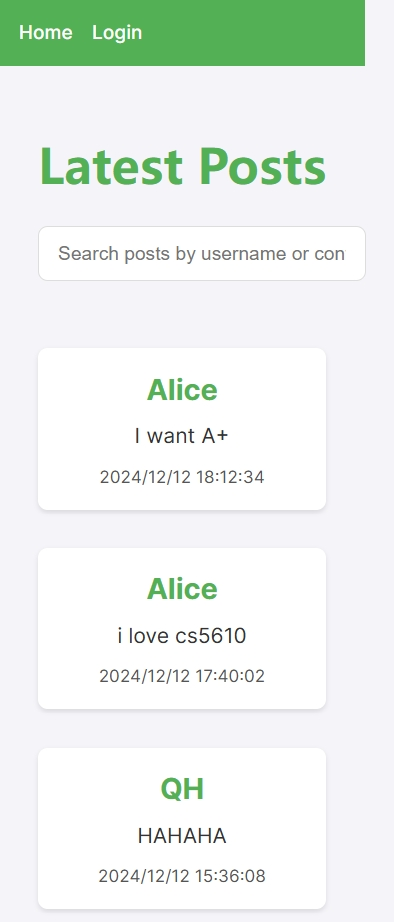
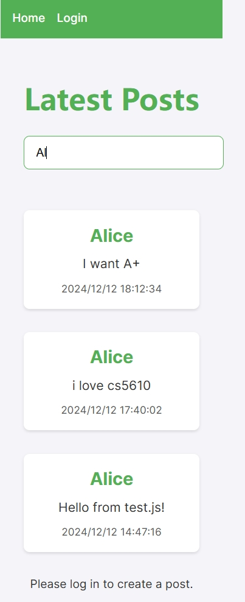
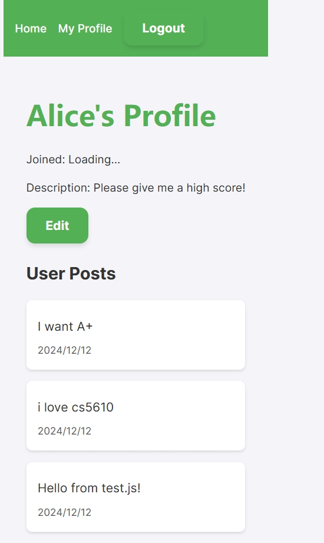

# Social Media App

## Part 1: Overview

### Technologies and Packages Used

**Backend:**
- **Framework:** Node.js with Express
- **Database:** MongoDB (hosted on MongoDB Atlas)
- **Packages:**
  - `mongoose`: For database operations
  - `express`: To handle routing and middleware
  - `bcrypt`: For password hashing
  - `dotenv`: To manage environment variables
  - `cors`: To handle cross-origin requests
  - `body-parser`: To parse incoming request bodies

**Frontend:**
- **Framework:** React
- **Build Tool:** Vite
- **Packages:**
  - `react-router-dom`: For routing between pages
  - `prop-types`: For type-checking React props
  - `vite`: To bundle the app for production

### URLs
- **Frontend:** [https://qhmadoka-twitterapp.onrender.com](https://qhmadoka-twitterapp.onrender.com)
- **Backend:** [https://qhmadoka-twitterapp-backend.onrender.com](https://qhmadoka-twitterapp-backend.onrender.com)

---

## Part 2: User Guide

### How to Use

1. **Login**  
   Use the default user credentials:  
   - **Username:** `Alice`  
   - **Password:** `Password123`  

   

2. **Homepage**  
   Once logged in, view all existing posts. Logged-in users can also create new posts by typing content and clicking "Post."

   

3. **Search Posts**  
   Use the search bar at the top to filter posts based on keywords.

   

4. **User Profile**  
   Navigate to the profile page to view and edit the user description. Updates will persist across sessions.

   

### Features Implemented
- User authentication (login/logout)
- Post creation and deletion
- Profile description update and persistence
- Posts search functionality
- Fully responsive frontend design

---

## Part 3: Reflection

### Challenges Faced
- **Cross-Origin Resource Sharing (CORS):** Configuring CORS to allow frontend-backend communication without errors was a significant challenge, especially with the deployment on Render.
- **Deployment:** Ensuring both the frontend and backend were correctly deployed and configured for production took time, particularly when handling environment variables and API base URLs.
- **State Management:** Managing user authentication and ensuring data consistency across components required careful handling of React’s `useContext` and `useState` hooks.

### Additional Features with More Time
- **File Uploads:** Allowing users to upload profile pictures or images with their posts.
- **Real-Time Updates:** Implementing WebSockets to update posts and user data in real-time.
- **Enhanced Search:** Adding filters for date, user, or hashtags.
- **Pagination:** Improving performance by implementing pagination for posts.
- **Dark Mode:** Adding a dark mode toggle for better user experience.

### Assumptions Made
- Default credentials (`Alice` and `Password123`) were assumed to be sufficient for testing.
- Users only delete their own posts.
- Security measures like HTTPS, input sanitization, and advanced error handling are outside the scope of this assignment but are crucial for production.
- The app will only handle text-based posts without file uploads.

### Time Taken
This assignment took approximately **30 hours** to complete, including:
- Initial setup and local development: 10 hours
- Backend and database integration: 8 hours
- Frontend implementation: 7 hours
- Deployment and debugging: 5 hours

